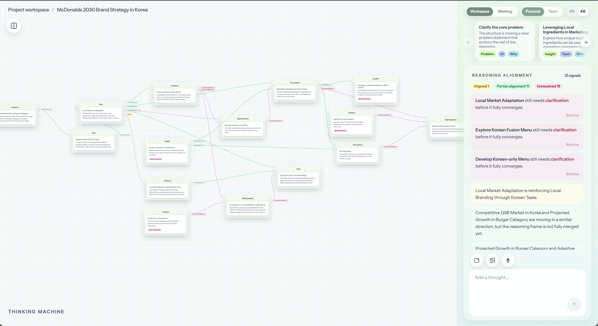
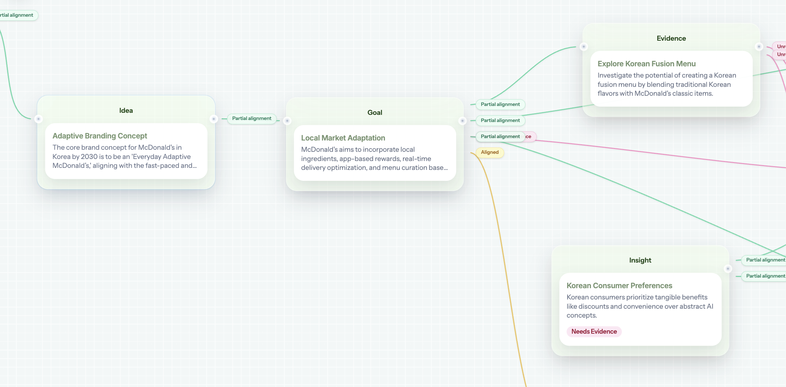

# Thinking Machine

Thinking Machine is a project-based reasoning workspace for turning loose thoughts into a clearer shared structure.

It is not a generic mind map. The product is designed around a specific workflow:

- capture an early thought
- turn it into reasoning nodes
- see how nodes align, partially align, or remain unresolved
- resolve gaps through a focused right-side workspace
- decide what stays personal and what becomes team-visible

The current interface prioritizes information design over feature breadth. It intentionally avoids proposal comparison, search exploration, and advanced copilot behavior in this phase.

## Product Intent

Thinking Machine helps a person or small team make sense of ambiguous work: brand direction, research synthesis, strategy framing, product concepts, or design reasoning.

The canvas is the structured memory. The right panel is the working surface. Together they support a loop:

1. Add or select a thought.
2. Inspect the reasoning graph around it.
3. Identify what needs definition, evidence, validation, or sharing.
4. Resolve unresolved differences by adding clarification or related context.
5. Promote stronger reasoning from personal work into team context.

The goal is to make reasoning visible without overwhelming the user with too many tags, labels, or decorative states.

## Product Screenshots

### Workspace Overview

The full workspace combines the reasoning canvas with the right-side workspace panel. The canvas shows the structure of the project while the panel highlights alignment signals and unresolved reasoning that can be acted on.



### Reasoning Graph Close-Up

The canvas uses draggable reasoning nodes and lightweight relationship labels. Node ports stay neutral, while relationship state is communicated through the edge color and alignment pill.



## Current Features

### Project Workspace

- Project dashboard at `/projects`
- Project detail workspace at `/projects/[id]`
- Editable project title in the workspace header
- Local project persistence through browser storage
- Mock login entry from `/`

### Reasoning Canvas

- React Flow canvas for draggable reasoning nodes
- Node categories such as `Problem`, `Goal`, `Insight`, `Evidence`, `Assumption`, `Constraint`, `Risk`, `Decision`, and `OpenQuestion`
- Neutral node connection ports to reduce color noise
- Relationship state shown through edge color and pill labels only
- Relationship states include `Aligned`, `Partial alignment`, and `Unresolved difference`
- Canvas nodes use a grab cursor because they are drag-and-drop objects

### Action-Oriented Node States

Canvas cards avoid repetitive tags like `User`, `Why`, `Problem`, and `Solution`.

Instead, nodes surface actionable states:

- `Needs Definition`
- `Needs Evidence`
- `Needs Validation`
- `Ready to Share`

These states react to linked nodes. For example, adding supporting evidence can remove a `Needs Evidence` state instead of leaving the warning permanently visible.

### Right Workspace Panel

The right panel is the primary interaction surface for selected context.

It includes:

- compact selected-node details
- related reasoning context
- chat-style responses and follow-up input
- attachment actions for note, image, and voice placeholders
- suggestion carousel cards
- language toggle for selected UI helper copy

Core product terms remain in English, including `Workspace`, `Meeting`, `Personal`, `Team`, node categories, and relationship states.

### Reasoning Alignment

The alignment section summarizes relationship health in the visible graph.

It uses a compact status row:

- `Aligned`
- `Partial alignment`
- `Unresolved`

Unresolved cards are interactive. Clicking one attaches the relevant nodes to the right panel and asks the agent for the smallest useful next clarification, comment, or evidence that could move the reasoning forward.

### Team Context

The team context panel includes:

- member list with lightweight actor icons
- activity panel instead of a timeline label
- compact activity cards with node type, node title, actor icon, and timestamp
- local activity tracking for changes that affect the reasoning context

This is currently a local collaboration model, not real-time multi-user sync.

## Design Principles

The current UI direction follows a few explicit rules:

- titles should appear before tags
- tags should not compete with the main content
- repeated labels should be removed when they do not change user action
- relationship meaning should be communicated by one clear visual system
- passive warnings should become clickable paths toward resolution
- cards should use cursor affordances that match behavior: grab on canvas, pointer in panels

## What Is Not Included Yet

This phase does not include:

- proposal comparison
- search exploration
- advanced copilot orchestration
- real-time collaboration
- production authentication
- database-backed persistence
- final AI automation workflows

Some AI endpoints exist, but the product should still be understood as an MVP workspace with placeholder and early-stage AI behavior.

## Tech Stack

- Next.js 16
- React 19
- Pages Router
- React Flow
- Framer Motion
- Tailwind CSS 4
- OpenAI SDK
- Zod

## Important Routes

### `/`

Mock login entry screen.

### `/projects`

Project dashboard for creating and opening projects.

### `/projects/[id]`

Main Thinking Machine workspace with canvas, right workspace panel, and team context panel.

## Important Files

```text
pages/
  index.jsx
  projects.jsx
  projects/[id].jsx
  api/
    analyze.js
    chat.js
    chat-to-nodes.js

components/thinkingMachine/
  ThinkingMachine.jsx
  NodeMap.jsx
  RightAgentDrawer.jsx
  LeftTeamContextPanel.jsx
  cards/
  drawer/
  edges/
  hooks/
  layout/
  nodes/
  teamContext/

lib/thinkingMachine/
  nodeMeta.js
  reasoningAlignment.js
  connectorEdges.js
  reactflowTransforms.js
  projectGraph.js

lib/thinkingAgent.js
```

## Environment

Create `.env.local`:

```bash
OPENAI_API_KEY=your_key_here
```

The app can run without production authentication. Project data is currently stored locally in the browser.

## Install

```bash
npm install
```

## Run Locally

Default Next.js port:

```bash
npm run dev
```

The current working browser session has usually been run on port `3001`:

```bash
npm run dev -- -p 3001
```

Open:

- [http://localhost:3001](http://localhost:3001)

## Build

```bash
npm run build
npm run start
```

## Lint

```bash
npm run lint
```

Note: the full lint command may still surface pre-existing hook dependency warnings in older components. Recent UI changes have been checked with targeted ESLint runs on the edited files.

## Current Status

Thinking Machine is an active MVP prototype focused on:

- clean routing
- local runnability
- reasoning data model direction
- graph interaction quality
- compact information hierarchy
- resolving reasoning gaps through interaction rather than passive labels

The product direction is now less about drawing many categorized notes and more about helping a user see what needs to be clarified, evidenced, validated, or shared.
